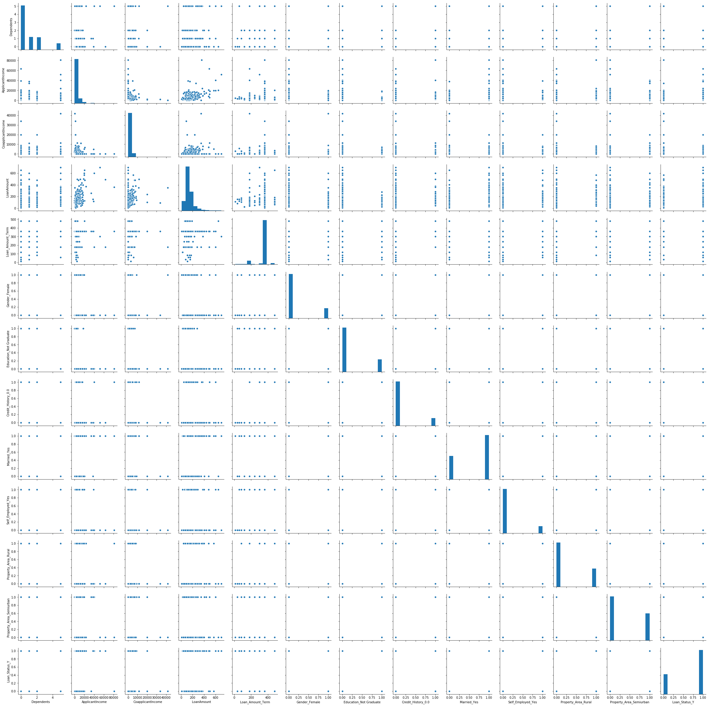

<h2>Problem Statement</h2>

About Company
Dream Housing Finance company deals in all home loans. They have presence across all urban, semi urban and rural areas. Customer first apply for home loan after that company validates the customer eligibility for loan.

<h2>Problem</h2>

Company wants to automate the loan eligibility process (real time) based on customer detail provided while filling online application form. These details are Gender, Marital Status, Education, Number of Dependents, Income, Loan Amount, Credit History and others. To automate this process, they have given a problem to identify the customers segments, those are eligible for loan amount so that they can specifically target these customers. Here they have provided a partial data set.

[Competition Link](https://datahack.analyticsvidhya.com/contest/practice-problem-loan-prediction-iii/)


```python
import numpy as np
import pandas as pd
import matplotlib.pyplot as plt
import seaborn as sns

from datetime import datetime

from sklearn.preprocessing import StandardScaler
from sklearn.preprocessing import Imputer
from sklearn.model_selection import GridSearchCV , train_test_split , cross_val_score
from sklearn.metrics import classification_report , confusion_matrix


from sklearn.linear_model import LogisticRegression
from sklearn.naive_bayes import GaussianNB
from sklearn.neighbors import KNeighborsClassifier
from sklearn.tree import DecisionTreeClassifier
from sklearn.ensemble import RandomForestClassifier
from sklearn.ensemble import GradientBoostingClassifier
from sklearn.svm import SVC
from sklearn.metrics import roc_curve, auc
import os
import warnings
warnings.filterwarnings('ignore')

print(os.listdir("./"))

```

    ['train.csv', 'push.txt', '.git', 'submit.csv', 'sample.csv', 'test.csv', '.ipynb_checkpoints', 'README.md', 'LoanPrediction.ipynb']


<h3>Load and preview the data</h3>


```python
data = pd.read_csv('train.csv', index_col = 'Loan_ID')
data.head()
```


<div>
<style scoped>
    .dataframe tbody tr th:only-of-type {
        vertical-align: middle;
    }

    .dataframe tbody tr th {
        vertical-align: top;
    }

    .dataframe thead th {
        text-align: right;
    }
</style>
<table border="1" class="dataframe">
  <thead>
    <tr style="text-align: right;">
      <th></th>
      <th>Gender</th>
      <th>Married</th>
      <th>Dependents</th>
      <th>Education</th>
      <th>Self_Employed</th>
      <th>ApplicantIncome</th>
      <th>CoapplicantIncome</th>
      <th>LoanAmount</th>
      <th>Loan_Amount_Term</th>
      <th>Credit_History</th>
      <th>Property_Area</th>
      <th>Loan_Status</th>
    </tr>
    <tr>
      <th>Loan_ID</th>
      <th></th>
      <th></th>
      <th></th>
      <th></th>
      <th></th>
      <th></th>
      <th></th>
      <th></th>
      <th></th>
      <th></th>
      <th></th>
      <th></th>
    </tr>
  </thead>
  <tbody>
    <tr>
      <th>LP001002</th>
      <td>Male</td>
      <td>No</td>
      <td>0</td>
      <td>Graduate</td>
      <td>No</td>
      <td>5849</td>
      <td>0.0</td>
      <td>NaN</td>
      <td>360.0</td>
      <td>1.0</td>
      <td>Urban</td>
      <td>Y</td>
    </tr>
    <tr>
      <th>LP001003</th>
      <td>Male</td>
      <td>Yes</td>
      <td>1</td>
      <td>Graduate</td>
      <td>No</td>
      <td>4583</td>
      <td>1508.0</td>
      <td>128.0</td>
      <td>360.0</td>
      <td>1.0</td>
      <td>Rural</td>
      <td>N</td>
    </tr>
    <tr>
      <th>LP001005</th>
      <td>Male</td>
      <td>Yes</td>
      <td>0</td>
      <td>Graduate</td>
      <td>Yes</td>
      <td>3000</td>
      <td>0.0</td>
      <td>66.0</td>
      <td>360.0</td>
      <td>1.0</td>
      <td>Urban</td>
      <td>Y</td>
    </tr>
    <tr>
      <th>LP001006</th>
      <td>Male</td>
      <td>Yes</td>
      <td>0</td>
      <td>Not Graduate</td>
      <td>No</td>
      <td>2583</td>
      <td>2358.0</td>
      <td>120.0</td>
      <td>360.0</td>
      <td>1.0</td>
      <td>Urban</td>
      <td>Y</td>
    </tr>
    <tr>
      <th>LP001008</th>
      <td>Male</td>
      <td>No</td>
      <td>0</td>
      <td>Graduate</td>
      <td>No</td>
      <td>6000</td>
      <td>0.0</td>
      <td>141.0</td>
      <td>360.0</td>
      <td>1.0</td>
      <td>Urban</td>
      <td>Y</td>
    </tr>
  </tbody>
</table>
</div>


```python
test = pd.read_csv('test.csv' , index_col= 'Loan_ID')
test.head()
```


<div>
<style scoped>
    .dataframe tbody tr th:only-of-type {
        vertical-align: middle;
    }

    .dataframe tbody tr th {
        vertical-align: top;
    }

    .dataframe thead th {
        text-align: right;
    }
</style>
<table border="1" class="dataframe">
  <thead>
    <tr style="text-align: right;">
      <th></th>
      <th>Gender</th>
      <th>Married</th>
      <th>Dependents</th>
      <th>Education</th>
      <th>Self_Employed</th>
      <th>ApplicantIncome</th>
      <th>CoapplicantIncome</th>
      <th>LoanAmount</th>
      <th>Loan_Amount_Term</th>
      <th>Credit_History</th>
      <th>Property_Area</th>
    </tr>
    <tr>
      <th>Loan_ID</th>
      <th></th>
      <th></th>
      <th></th>
      <th></th>
      <th></th>
      <th></th>
      <th></th>
      <th></th>
      <th></th>
      <th></th>
      <th></th>
    </tr>
  </thead>
  <tbody>
    <tr>
      <th>LP001015</th>
      <td>Male</td>
      <td>Yes</td>
      <td>0</td>
      <td>Graduate</td>
      <td>No</td>
      <td>5720</td>
      <td>0</td>
      <td>110.0</td>
      <td>360.0</td>
      <td>1.0</td>
      <td>Urban</td>
    </tr>
    <tr>
      <th>LP001022</th>
      <td>Male</td>
      <td>Yes</td>
      <td>1</td>
      <td>Graduate</td>
      <td>No</td>
      <td>3076</td>
      <td>1500</td>
      <td>126.0</td>
      <td>360.0</td>
      <td>1.0</td>
      <td>Urban</td>
    </tr>
    <tr>
      <th>LP001031</th>
      <td>Male</td>
      <td>Yes</td>
      <td>2</td>
      <td>Graduate</td>
      <td>No</td>
      <td>5000</td>
      <td>1800</td>
      <td>208.0</td>
      <td>360.0</td>
      <td>1.0</td>
      <td>Urban</td>
    </tr>
    <tr>
      <th>LP001035</th>
      <td>Male</td>
      <td>Yes</td>
      <td>2</td>
      <td>Graduate</td>
      <td>No</td>
      <td>2340</td>
      <td>2546</td>
      <td>100.0</td>
      <td>360.0</td>
      <td>NaN</td>
      <td>Urban</td>
    </tr>
    <tr>
      <th>LP001051</th>
      <td>Male</td>
      <td>No</td>
      <td>0</td>
      <td>Not Graduate</td>
      <td>No</td>
      <td>3276</td>
      <td>0</td>
      <td>78.0</td>
      <td>360.0</td>
      <td>1.0</td>
      <td>Urban</td>
    </tr>
  </tbody>
</table>
</div>


<h3>We can observe that many of the feilds are categorical data . Lets find out all the unique values in these columns</h3>


```python
print("Gender Unique Value: "  , data.Gender.unique())
print("Dependents Unique Value: "  , data.Dependents.unique())
print("Education Unique Value: "  , data.Education.unique())
print("Credit_History Unique Value: "  , data.Credit_History.unique())
print("Property_Area Unique Value: "  , data.Property_Area.unique())
print("Loan_Status Unique Value: "  , data.Loan_Status.unique())

```

    Gender Unique Value:  ['Male' 'Female' nan]
    Dependents Unique Value:  ['0' '1' '2' '3+' nan]
    Education Unique Value:  ['Graduate' 'Not Graduate']
    Credit_History Unique Value:  [ 1.  0. nan]
    Property_Area Unique Value:  ['Urban' 'Rural' 'Semiurban']
    Loan_Status Unique Value:  ['Y' 'N']


<h3>Summarize the data</h3>


```python
data.info()
```

    <class 'pandas.core.frame.DataFrame'>
    Index: 614 entries, LP001002 to LP002990
    Data columns (total 12 columns):
    Gender               601 non-null object
    Married              611 non-null object
    Dependents           599 non-null object
    Education            614 non-null object
    Self_Employed        582 non-null object
    ApplicantIncome      614 non-null int64
    CoapplicantIncome    614 non-null float64
    LoanAmount           592 non-null float64
    Loan_Amount_Term     600 non-null float64
    Credit_History       564 non-null float64
    Property_Area        614 non-null object
    Loan_Status          614 non-null object
    dtypes: float64(4), int64(1), object(7)
    memory usage: 62.4+ KB


```python
data.describe()
```


<div>
<style scoped>
    .dataframe tbody tr th:only-of-type {
        vertical-align: middle;
    }

    .dataframe tbody tr th {
        vertical-align: top;
    }

    .dataframe thead th {
        text-align: right;
    }
</style>
<table border="1" class="dataframe">
  <thead>
    <tr style="text-align: right;">
      <th></th>
      <th>ApplicantIncome</th>
      <th>CoapplicantIncome</th>
      <th>LoanAmount</th>
      <th>Loan_Amount_Term</th>
      <th>Credit_History</th>
    </tr>
  </thead>
  <tbody>
    <tr>
      <th>count</th>
      <td>614.000000</td>
      <td>614.000000</td>
      <td>592.000000</td>
      <td>600.00000</td>
      <td>564.000000</td>
    </tr>
    <tr>
      <th>mean</th>
      <td>5403.459283</td>
      <td>1621.245798</td>
      <td>146.412162</td>
      <td>342.00000</td>
      <td>0.842199</td>
    </tr>
    <tr>
      <th>std</th>
      <td>6109.041673</td>
      <td>2926.248369</td>
      <td>85.587325</td>
      <td>65.12041</td>
      <td>0.364878</td>
    </tr>
    <tr>
      <th>min</th>
      <td>150.000000</td>
      <td>0.000000</td>
      <td>9.000000</td>
      <td>12.00000</td>
      <td>0.000000</td>
    </tr>
    <tr>
      <th>25%</th>
      <td>2877.500000</td>
      <td>0.000000</td>
      <td>100.000000</td>
      <td>360.00000</td>
      <td>1.000000</td>
    </tr>
    <tr>
      <th>50%</th>
      <td>3812.500000</td>
      <td>1188.500000</td>
      <td>128.000000</td>
      <td>360.00000</td>
      <td>1.000000</td>
    </tr>
    <tr>
      <th>75%</th>
      <td>5795.000000</td>
      <td>2297.250000</td>
      <td>168.000000</td>
      <td>360.00000</td>
      <td>1.000000</td>
    </tr>
    <tr>
      <th>max</th>
      <td>81000.000000</td>
      <td>41667.000000</td>
      <td>700.000000</td>
      <td>480.00000</td>
      <td>1.000000</td>
    </tr>
  </tbody>
</table>
</div>


```python
data.Dependents.replace('3+', '5', inplace=True)
data.head(10)
```


<div>
<style scoped>
    .dataframe tbody tr th:only-of-type {
        vertical-align: middle;
    }

    .dataframe tbody tr th {
        vertical-align: top;
    }

    .dataframe thead th {
        text-align: right;
    }
</style>
<table border="1" class="dataframe">
  <thead>
    <tr style="text-align: right;">
      <th></th>
      <th>Gender</th>
      <th>Married</th>
      <th>Dependents</th>
      <th>Education</th>
      <th>Self_Employed</th>
      <th>ApplicantIncome</th>
      <th>CoapplicantIncome</th>
      <th>LoanAmount</th>
      <th>Loan_Amount_Term</th>
      <th>Credit_History</th>
      <th>Property_Area</th>
      <th>Loan_Status</th>
    </tr>
    <tr>
      <th>Loan_ID</th>
      <th></th>
      <th></th>
      <th></th>
      <th></th>
      <th></th>
      <th></th>
      <th></th>
      <th></th>
      <th></th>
      <th></th>
      <th></th>
      <th></th>
    </tr>
  </thead>
  <tbody>
    <tr>
      <th>LP001002</th>
      <td>Male</td>
      <td>No</td>
      <td>0</td>
      <td>Graduate</td>
      <td>No</td>
      <td>5849</td>
      <td>0.0</td>
      <td>NaN</td>
      <td>360.0</td>
      <td>1.0</td>
      <td>Urban</td>
      <td>Y</td>
    </tr>
    <tr>
      <th>LP001003</th>
      <td>Male</td>
      <td>Yes</td>
      <td>1</td>
      <td>Graduate</td>
      <td>No</td>
      <td>4583</td>
      <td>1508.0</td>
      <td>128.0</td>
      <td>360.0</td>
      <td>1.0</td>
      <td>Rural</td>
      <td>N</td>
    </tr>
    <tr>
      <th>LP001005</th>
      <td>Male</td>
      <td>Yes</td>
      <td>0</td>
      <td>Graduate</td>
      <td>Yes</td>
      <td>3000</td>
      <td>0.0</td>
      <td>66.0</td>
      <td>360.0</td>
      <td>1.0</td>
      <td>Urban</td>
      <td>Y</td>
    </tr>
    <tr>
      <th>LP001006</th>
      <td>Male</td>
      <td>Yes</td>
      <td>0</td>
      <td>Not Graduate</td>
      <td>No</td>
      <td>2583</td>
      <td>2358.0</td>
      <td>120.0</td>
      <td>360.0</td>
      <td>1.0</td>
      <td>Urban</td>
      <td>Y</td>
    </tr>
    <tr>
      <th>LP001008</th>
      <td>Male</td>
      <td>No</td>
      <td>0</td>
      <td>Graduate</td>
      <td>No</td>
      <td>6000</td>
      <td>0.0</td>
      <td>141.0</td>
      <td>360.0</td>
      <td>1.0</td>
      <td>Urban</td>
      <td>Y</td>
    </tr>
    <tr>
      <th>LP001011</th>
      <td>Male</td>
      <td>Yes</td>
      <td>2</td>
      <td>Graduate</td>
      <td>Yes</td>
      <td>5417</td>
      <td>4196.0</td>
      <td>267.0</td>
      <td>360.0</td>
      <td>1.0</td>
      <td>Urban</td>
      <td>Y</td>
    </tr>
    <tr>
      <th>LP001013</th>
      <td>Male</td>
      <td>Yes</td>
      <td>0</td>
      <td>Not Graduate</td>
      <td>No</td>
      <td>2333</td>
      <td>1516.0</td>
      <td>95.0</td>
      <td>360.0</td>
      <td>1.0</td>
      <td>Urban</td>
      <td>Y</td>
    </tr>
    <tr>
      <th>LP001014</th>
      <td>Male</td>
      <td>Yes</td>
      <td>5</td>
      <td>Graduate</td>
      <td>No</td>
      <td>3036</td>
      <td>2504.0</td>
      <td>158.0</td>
      <td>360.0</td>
      <td>0.0</td>
      <td>Semiurban</td>
      <td>N</td>
    </tr>
    <tr>
      <th>LP001018</th>
      <td>Male</td>
      <td>Yes</td>
      <td>2</td>
      <td>Graduate</td>
      <td>No</td>
      <td>4006</td>
      <td>1526.0</td>
      <td>168.0</td>
      <td>360.0</td>
      <td>1.0</td>
      <td>Urban</td>
      <td>Y</td>
    </tr>
    <tr>
      <th>LP001020</th>
      <td>Male</td>
      <td>Yes</td>
      <td>1</td>
      <td>Graduate</td>
      <td>No</td>
      <td>12841</td>
      <td>10968.0</td>
      <td>349.0</td>
      <td>360.0</td>
      <td>1.0</td>
      <td>Semiurban</td>
      <td>N</td>
    </tr>
  </tbody>
</table>
</div>


```python
test.Dependents.replace('3+', '5', inplace=True)
test.head(10)
```


<div>
<style scoped>
    .dataframe tbody tr th:only-of-type {
        vertical-align: middle;
    }

    .dataframe tbody tr th {
        vertical-align: top;
    }

    .dataframe thead th {
        text-align: right;
    }
</style>
<table border="1" class="dataframe">
  <thead>
    <tr style="text-align: right;">
      <th></th>
      <th>Gender</th>
      <th>Married</th>
      <th>Dependents</th>
      <th>Education</th>
      <th>Self_Employed</th>
      <th>ApplicantIncome</th>
      <th>CoapplicantIncome</th>
      <th>LoanAmount</th>
      <th>Loan_Amount_Term</th>
      <th>Credit_History</th>
      <th>Property_Area</th>
    </tr>
    <tr>
      <th>Loan_ID</th>
      <th></th>
      <th></th>
      <th></th>
      <th></th>
      <th></th>
      <th></th>
      <th></th>
      <th></th>
      <th></th>
      <th></th>
      <th></th>
    </tr>
  </thead>
  <tbody>
    <tr>
      <th>LP001015</th>
      <td>Male</td>
      <td>Yes</td>
      <td>0</td>
      <td>Graduate</td>
      <td>No</td>
      <td>5720</td>
      <td>0</td>
      <td>110.0</td>
      <td>360.0</td>
      <td>1.0</td>
      <td>Urban</td>
    </tr>
    <tr>
      <th>LP001022</th>
      <td>Male</td>
      <td>Yes</td>
      <td>1</td>
      <td>Graduate</td>
      <td>No</td>
      <td>3076</td>
      <td>1500</td>
      <td>126.0</td>
      <td>360.0</td>
      <td>1.0</td>
      <td>Urban</td>
    </tr>
    <tr>
      <th>LP001031</th>
      <td>Male</td>
      <td>Yes</td>
      <td>2</td>
      <td>Graduate</td>
      <td>No</td>
      <td>5000</td>
      <td>1800</td>
      <td>208.0</td>
      <td>360.0</td>
      <td>1.0</td>
      <td>Urban</td>
    </tr>
    <tr>
      <th>LP001035</th>
      <td>Male</td>
      <td>Yes</td>
      <td>2</td>
      <td>Graduate</td>
      <td>No</td>
      <td>2340</td>
      <td>2546</td>
      <td>100.0</td>
      <td>360.0</td>
      <td>NaN</td>
      <td>Urban</td>
    </tr>
    <tr>
      <th>LP001051</th>
      <td>Male</td>
      <td>No</td>
      <td>0</td>
      <td>Not Graduate</td>
      <td>No</td>
      <td>3276</td>
      <td>0</td>
      <td>78.0</td>
      <td>360.0</td>
      <td>1.0</td>
      <td>Urban</td>
    </tr>
    <tr>
      <th>LP001054</th>
      <td>Male</td>
      <td>Yes</td>
      <td>0</td>
      <td>Not Graduate</td>
      <td>Yes</td>
      <td>2165</td>
      <td>3422</td>
      <td>152.0</td>
      <td>360.0</td>
      <td>1.0</td>
      <td>Urban</td>
    </tr>
    <tr>
      <th>LP001055</th>
      <td>Female</td>
      <td>No</td>
      <td>1</td>
      <td>Not Graduate</td>
      <td>No</td>
      <td>2226</td>
      <td>0</td>
      <td>59.0</td>
      <td>360.0</td>
      <td>1.0</td>
      <td>Semiurban</td>
    </tr>
    <tr>
      <th>LP001056</th>
      <td>Male</td>
      <td>Yes</td>
      <td>2</td>
      <td>Not Graduate</td>
      <td>No</td>
      <td>3881</td>
      <td>0</td>
      <td>147.0</td>
      <td>360.0</td>
      <td>0.0</td>
      <td>Rural</td>
    </tr>
    <tr>
      <th>LP001059</th>
      <td>Male</td>
      <td>Yes</td>
      <td>2</td>
      <td>Graduate</td>
      <td>NaN</td>
      <td>13633</td>
      <td>0</td>
      <td>280.0</td>
      <td>240.0</td>
      <td>1.0</td>
      <td>Urban</td>
    </tr>
    <tr>
      <th>LP001067</th>
      <td>Male</td>
      <td>No</td>
      <td>0</td>
      <td>Not Graduate</td>
      <td>No</td>
      <td>2400</td>
      <td>2400</td>
      <td>123.0</td>
      <td>360.0</td>
      <td>1.0</td>
      <td>Semiurban</td>
    </tr>
  </tbody>
</table>
</div>


```python
categorical_col = ['Gender' , 'Married' , 'Education' , 'Self_Employed' , 'Credit_History' ,'Property_Area','Loan_Status' ]
```

<h3>Encode categorical data<h3>


```python
data[categorical_col] = data[categorical_col].astype('category')
data.info()

```

    <class 'pandas.core.frame.DataFrame'>
    Index: 614 entries, LP001002 to LP002990
    Data columns (total 12 columns):
    Gender               601 non-null category
    Married              611 non-null category
    Dependents           599 non-null object
    Education            614 non-null category
    Self_Employed        582 non-null category
    ApplicantIncome      614 non-null int64
    CoapplicantIncome    614 non-null float64
    LoanAmount           592 non-null float64
    Loan_Amount_Term     600 non-null float64
    Credit_History       564 non-null category
    Property_Area        614 non-null category
    Loan_Status          614 non-null category
    dtypes: category(7), float64(3), int64(1), object(1)
    memory usage: 33.6+ KB


```python
categorical_col = ['Gender' , 'Married' , 'Education' , 'Self_Employed' , 'Credit_History' ,'Property_Area' ]
test[categorical_col] = test[categorical_col].astype('category')
test.info()
```

    <class 'pandas.core.frame.DataFrame'>
    Index: 367 entries, LP001015 to LP002989
    Data columns (total 11 columns):
    Gender               356 non-null category
    Married              367 non-null category
    Dependents           357 non-null object
    Education            367 non-null category
    Self_Employed        344 non-null category
    ApplicantIncome      367 non-null int64
    CoapplicantIncome    367 non-null int64
    LoanAmount           362 non-null float64
    Loan_Amount_Term     361 non-null float64
    Credit_History       338 non-null category
    Property_Area        367 non-null category
    dtypes: category(6), float64(2), int64(2), object(1)
    memory usage: 19.9+ KB


```python
test.head()
```


<div>
<style scoped>
    .dataframe tbody tr th:only-of-type {
        vertical-align: middle;
    }

    .dataframe tbody tr th {
        vertical-align: top;
    }

    .dataframe thead th {
        text-align: right;
    }
</style>
<table border="1" class="dataframe">
  <thead>
    <tr style="text-align: right;">
      <th></th>
      <th>Gender</th>
      <th>Married</th>
      <th>Dependents</th>
      <th>Education</th>
      <th>Self_Employed</th>
      <th>ApplicantIncome</th>
      <th>CoapplicantIncome</th>
      <th>LoanAmount</th>
      <th>Loan_Amount_Term</th>
      <th>Credit_History</th>
      <th>Property_Area</th>
    </tr>
    <tr>
      <th>Loan_ID</th>
      <th></th>
      <th></th>
      <th></th>
      <th></th>
      <th></th>
      <th></th>
      <th></th>
      <th></th>
      <th></th>
      <th></th>
      <th></th>
    </tr>
  </thead>
  <tbody>
    <tr>
      <th>LP001015</th>
      <td>Male</td>
      <td>Yes</td>
      <td>0</td>
      <td>Graduate</td>
      <td>No</td>
      <td>5720</td>
      <td>0</td>
      <td>110.0</td>
      <td>360.0</td>
      <td>1.0</td>
      <td>Urban</td>
    </tr>
    <tr>
      <th>LP001022</th>
      <td>Male</td>
      <td>Yes</td>
      <td>1</td>
      <td>Graduate</td>
      <td>No</td>
      <td>3076</td>
      <td>1500</td>
      <td>126.0</td>
      <td>360.0</td>
      <td>1.0</td>
      <td>Urban</td>
    </tr>
    <tr>
      <th>LP001031</th>
      <td>Male</td>
      <td>Yes</td>
      <td>2</td>
      <td>Graduate</td>
      <td>No</td>
      <td>5000</td>
      <td>1800</td>
      <td>208.0</td>
      <td>360.0</td>
      <td>1.0</td>
      <td>Urban</td>
    </tr>
    <tr>
      <th>LP001035</th>
      <td>Male</td>
      <td>Yes</td>
      <td>2</td>
      <td>Graduate</td>
      <td>No</td>
      <td>2340</td>
      <td>2546</td>
      <td>100.0</td>
      <td>360.0</td>
      <td>NaN</td>
      <td>Urban</td>
    </tr>
    <tr>
      <th>LP001051</th>
      <td>Male</td>
      <td>No</td>
      <td>0</td>
      <td>Not Graduate</td>
      <td>No</td>
      <td>3276</td>
      <td>0</td>
      <td>78.0</td>
      <td>360.0</td>
      <td>1.0</td>
      <td>Urban</td>
    </tr>
  </tbody>
</table>
</div>


<h3> Fill the missing value with most common value <h3>


```python
for col in categorical_col:
    data[col].fillna(data[col].mode()[0] , inplace=True)
data['Dependents'].fillna(data['Dependents'].mode()[0] , inplace =True)
data['Dependents'] = data['Dependents'].astype('int')
```


```python
data.info()
```

    <class 'pandas.core.frame.DataFrame'>
    Index: 614 entries, LP001002 to LP002990
    Data columns (total 12 columns):
    Gender               614 non-null category
    Married              614 non-null category
    Dependents           614 non-null int64
    Education            614 non-null category
    Self_Employed        614 non-null category
    ApplicantIncome      614 non-null int64
    CoapplicantIncome    614 non-null float64
    LoanAmount           592 non-null float64
    Loan_Amount_Term     600 non-null float64
    Credit_History       614 non-null category
    Property_Area        614 non-null category
    Loan_Status          614 non-null category
    dtypes: category(7), float64(3), int64(2)
    memory usage: 33.6+ KB


```python
test.head()
```


<div>
<style scoped>
    .dataframe tbody tr th:only-of-type {
        vertical-align: middle;
    }

    .dataframe tbody tr th {
        vertical-align: top;
    }

    .dataframe thead th {
        text-align: right;
    }
</style>
<table border="1" class="dataframe">
  <thead>
    <tr style="text-align: right;">
      <th></th>
      <th>Gender</th>
      <th>Married</th>
      <th>Dependents</th>
      <th>Education</th>
      <th>Self_Employed</th>
      <th>ApplicantIncome</th>
      <th>CoapplicantIncome</th>
      <th>LoanAmount</th>
      <th>Loan_Amount_Term</th>
      <th>Credit_History</th>
      <th>Property_Area</th>
    </tr>
    <tr>
      <th>Loan_ID</th>
      <th></th>
      <th></th>
      <th></th>
      <th></th>
      <th></th>
      <th></th>
      <th></th>
      <th></th>
      <th></th>
      <th></th>
      <th></th>
    </tr>
  </thead>
  <tbody>
    <tr>
      <th>LP001015</th>
      <td>Male</td>
      <td>Yes</td>
      <td>0</td>
      <td>Graduate</td>
      <td>No</td>
      <td>5720</td>
      <td>0</td>
      <td>110.0</td>
      <td>360.0</td>
      <td>1.0</td>
      <td>Urban</td>
    </tr>
    <tr>
      <th>LP001022</th>
      <td>Male</td>
      <td>Yes</td>
      <td>1</td>
      <td>Graduate</td>
      <td>No</td>
      <td>3076</td>
      <td>1500</td>
      <td>126.0</td>
      <td>360.0</td>
      <td>1.0</td>
      <td>Urban</td>
    </tr>
    <tr>
      <th>LP001031</th>
      <td>Male</td>
      <td>Yes</td>
      <td>2</td>
      <td>Graduate</td>
      <td>No</td>
      <td>5000</td>
      <td>1800</td>
      <td>208.0</td>
      <td>360.0</td>
      <td>1.0</td>
      <td>Urban</td>
    </tr>
    <tr>
      <th>LP001035</th>
      <td>Male</td>
      <td>Yes</td>
      <td>2</td>
      <td>Graduate</td>
      <td>No</td>
      <td>2340</td>
      <td>2546</td>
      <td>100.0</td>
      <td>360.0</td>
      <td>NaN</td>
      <td>Urban</td>
    </tr>
    <tr>
      <th>LP001051</th>
      <td>Male</td>
      <td>No</td>
      <td>0</td>
      <td>Not Graduate</td>
      <td>No</td>
      <td>3276</td>
      <td>0</td>
      <td>78.0</td>
      <td>360.0</td>
      <td>1.0</td>
      <td>Urban</td>
    </tr>
  </tbody>
</table>
</div>


```python
for col in categorical_col:
    test[col].fillna(test[col].mode()[0] , inplace=True)
test['Dependents'].fillna(test['Dependents'].mode()[0] , inplace =True)
test['Dependents'] = test['Dependents'].astype('int')
```


```python
numerical_col = ['ApplicantIncome' ,'CoapplicantIncome' , 'LoanAmount' , 'Loan_Amount_Term' ]
```


```python
for col in numerical_col:
    data[col].fillna(data[col].median() , inplace =True)
```


```python
data.info()
```

    <class 'pandas.core.frame.DataFrame'>
    Index: 614 entries, LP001002 to LP002990
    Data columns (total 12 columns):
    Gender               614 non-null category
    Married              614 non-null category
    Dependents           614 non-null int64
    Education            614 non-null category
    Self_Employed        614 non-null category
    ApplicantIncome      614 non-null int64
    CoapplicantIncome    614 non-null float64
    LoanAmount           614 non-null float64
    Loan_Amount_Term     614 non-null float64
    Credit_History       614 non-null category
    Property_Area        614 non-null category
    Loan_Status          614 non-null category
    dtypes: category(7), float64(3), int64(2)
    memory usage: 33.6+ KB


```python
for col in numerical_col:
    test[col].fillna(test[col].median() , inplace =True)
test.info()
```

    <class 'pandas.core.frame.DataFrame'>
    Index: 367 entries, LP001015 to LP002989
    Data columns (total 11 columns):
    Gender               367 non-null category
    Married              367 non-null category
    Dependents           367 non-null int64
    Education            367 non-null category
    Self_Employed        367 non-null category
    ApplicantIncome      367 non-null int64
    CoapplicantIncome    367 non-null int64
    LoanAmount           367 non-null float64
    Loan_Amount_Term     367 non-null float64
    Credit_History       367 non-null category
    Property_Area        367 non-null category
    dtypes: category(6), float64(2), int64(3)
    memory usage: 19.9+ KB


```python
print("Gender Unique Value: "  , data.Gender.unique())
print("Education Unique Value: "  , data.Education.unique())
print("Credit_History Unique Value: "  , data.Credit_History.unique())
print("Property_Area Unique Value: "  , data.Property_Area.unique())
print("Loan_Status Unique Value: "  , data.Loan_Status.unique())

```

    Gender Unique Value:  [Male, Female]
    Categories (2, object): [Male, Female]
    Education Unique Value:  [Graduate, Not Graduate]
    Categories (2, object): [Graduate, Not Graduate]
    Credit_History Unique Value:  [1.0, 0.0]
    Categories (2, float64): [1.0, 0.0]
    Property_Area Unique Value:  [Urban, Rural, Semiurban]
    Categories (3, object): [Urban, Rural, Semiurban]
    Loan_Status Unique Value:  [Y, N]
    Categories (2, object): [Y, N]


<h1> OneHot </h1>


```python
data = pd.get_dummies(data ,columns = ['Gender' , 'Education' ,'Credit_History','Married' , 'Self_Employed' , 'Property_Area','Loan_Status' ])
```


```python
data.head()
```


<div>
<style scoped>
    .dataframe tbody tr th:only-of-type {
        vertical-align: middle;
    }

    .dataframe tbody tr th {
        vertical-align: top;
    }

    .dataframe thead th {
        text-align: right;
    }
</style>
<table border="1" class="dataframe">
  <thead>
    <tr style="text-align: right;">
      <th></th>
      <th>Dependents</th>
      <th>ApplicantIncome</th>
      <th>CoapplicantIncome</th>
      <th>LoanAmount</th>
      <th>Loan_Amount_Term</th>
      <th>Gender_Female</th>
      <th>Gender_Male</th>
      <th>Education_Graduate</th>
      <th>Education_Not Graduate</th>
      <th>Credit_History_0.0</th>
      <th>Credit_History_1.0</th>
      <th>Married_No</th>
      <th>Married_Yes</th>
      <th>Self_Employed_No</th>
      <th>Self_Employed_Yes</th>
      <th>Property_Area_Rural</th>
      <th>Property_Area_Semiurban</th>
      <th>Property_Area_Urban</th>
      <th>Loan_Status_N</th>
      <th>Loan_Status_Y</th>
    </tr>
    <tr>
      <th>Loan_ID</th>
      <th></th>
      <th></th>
      <th></th>
      <th></th>
      <th></th>
      <th></th>
      <th></th>
      <th></th>
      <th></th>
      <th></th>
      <th></th>
      <th></th>
      <th></th>
      <th></th>
      <th></th>
      <th></th>
      <th></th>
      <th></th>
      <th></th>
      <th></th>
    </tr>
  </thead>
  <tbody>
    <tr>
      <th>LP001002</th>
      <td>0</td>
      <td>5849</td>
      <td>0.0</td>
      <td>128.0</td>
      <td>360.0</td>
      <td>0</td>
      <td>1</td>
      <td>1</td>
      <td>0</td>
      <td>0</td>
      <td>1</td>
      <td>1</td>
      <td>0</td>
      <td>1</td>
      <td>0</td>
      <td>0</td>
      <td>0</td>
      <td>1</td>
      <td>0</td>
      <td>1</td>
    </tr>
    <tr>
      <th>LP001003</th>
      <td>1</td>
      <td>4583</td>
      <td>1508.0</td>
      <td>128.0</td>
      <td>360.0</td>
      <td>0</td>
      <td>1</td>
      <td>1</td>
      <td>0</td>
      <td>0</td>
      <td>1</td>
      <td>0</td>
      <td>1</td>
      <td>1</td>
      <td>0</td>
      <td>1</td>
      <td>0</td>
      <td>0</td>
      <td>1</td>
      <td>0</td>
    </tr>
    <tr>
      <th>LP001005</th>
      <td>0</td>
      <td>3000</td>
      <td>0.0</td>
      <td>66.0</td>
      <td>360.0</td>
      <td>0</td>
      <td>1</td>
      <td>1</td>
      <td>0</td>
      <td>0</td>
      <td>1</td>
      <td>0</td>
      <td>1</td>
      <td>0</td>
      <td>1</td>
      <td>0</td>
      <td>0</td>
      <td>1</td>
      <td>0</td>
      <td>1</td>
    </tr>
    <tr>
      <th>LP001006</th>
      <td>0</td>
      <td>2583</td>
      <td>2358.0</td>
      <td>120.0</td>
      <td>360.0</td>
      <td>0</td>
      <td>1</td>
      <td>0</td>
      <td>1</td>
      <td>0</td>
      <td>1</td>
      <td>0</td>
      <td>1</td>
      <td>1</td>
      <td>0</td>
      <td>0</td>
      <td>0</td>
      <td>1</td>
      <td>0</td>
      <td>1</td>
    </tr>
    <tr>
      <th>LP001008</th>
      <td>0</td>
      <td>6000</td>
      <td>0.0</td>
      <td>141.0</td>
      <td>360.0</td>
      <td>0</td>
      <td>1</td>
      <td>1</td>
      <td>0</td>
      <td>0</td>
      <td>1</td>
      <td>1</td>
      <td>0</td>
      <td>1</td>
      <td>0</td>
      <td>0</td>
      <td>0</td>
      <td>1</td>
      <td>0</td>
      <td>1</td>
    </tr>
  </tbody>
</table>
</div>


```python
redundant_col = ['Loan_Status_N','Gender_Male' ,'Education_Graduate' ,  'Credit_History_1.0' ,'Married_No' , 'Self_Employed_No' ,'Property_Area_Urban'  ]
data.drop(axis = 1, columns=redundant_col , inplace = True)
```


```python
data.head(3)
```


<div>
<style scoped>
    .dataframe tbody tr th:only-of-type {
        vertical-align: middle;
    }

    .dataframe tbody tr th {
        vertical-align: top;
    }

    .dataframe thead th {
        text-align: right;
    }
</style>
<table border="1" class="dataframe">
  <thead>
    <tr style="text-align: right;">
      <th></th>
      <th>Dependents</th>
      <th>ApplicantIncome</th>
      <th>CoapplicantIncome</th>
      <th>LoanAmount</th>
      <th>Loan_Amount_Term</th>
      <th>Gender_Female</th>
      <th>Education_Not Graduate</th>
      <th>Credit_History_0.0</th>
      <th>Married_Yes</th>
      <th>Self_Employed_Yes</th>
      <th>Property_Area_Rural</th>
      <th>Property_Area_Semiurban</th>
      <th>Loan_Status_Y</th>
    </tr>
    <tr>
      <th>Loan_ID</th>
      <th></th>
      <th></th>
      <th></th>
      <th></th>
      <th></th>
      <th></th>
      <th></th>
      <th></th>
      <th></th>
      <th></th>
      <th></th>
      <th></th>
      <th></th>
    </tr>
  </thead>
  <tbody>
    <tr>
      <th>LP001002</th>
      <td>0</td>
      <td>5849</td>
      <td>0.0</td>
      <td>128.0</td>
      <td>360.0</td>
      <td>0</td>
      <td>0</td>
      <td>0</td>
      <td>0</td>
      <td>0</td>
      <td>0</td>
      <td>0</td>
      <td>1</td>
    </tr>
    <tr>
      <th>LP001003</th>
      <td>1</td>
      <td>4583</td>
      <td>1508.0</td>
      <td>128.0</td>
      <td>360.0</td>
      <td>0</td>
      <td>0</td>
      <td>0</td>
      <td>1</td>
      <td>0</td>
      <td>1</td>
      <td>0</td>
      <td>0</td>
    </tr>
    <tr>
      <th>LP001005</th>
      <td>0</td>
      <td>3000</td>
      <td>0.0</td>
      <td>66.0</td>
      <td>360.0</td>
      <td>0</td>
      <td>0</td>
      <td>0</td>
      <td>1</td>
      <td>1</td>
      <td>0</td>
      <td>0</td>
      <td>1</td>
    </tr>
  </tbody>
</table>
</div>


```python
test = pd.get_dummies(test ,columns = ['Gender' , 'Education' ,'Credit_History','Married' , 'Self_Employed' , 'Property_Area'])
test.head()
```


<div>
<style scoped>
    .dataframe tbody tr th:only-of-type {
        vertical-align: middle;
    }

    .dataframe tbody tr th {
        vertical-align: top;
    }

    .dataframe thead th {
        text-align: right;
    }
</style>
<table border="1" class="dataframe">
  <thead>
    <tr style="text-align: right;">
      <th></th>
      <th>Dependents</th>
      <th>ApplicantIncome</th>
      <th>CoapplicantIncome</th>
      <th>LoanAmount</th>
      <th>Loan_Amount_Term</th>
      <th>Gender_Female</th>
      <th>Gender_Male</th>
      <th>Education_Graduate</th>
      <th>Education_Not Graduate</th>
      <th>Credit_History_0.0</th>
      <th>Credit_History_1.0</th>
      <th>Married_No</th>
      <th>Married_Yes</th>
      <th>Self_Employed_No</th>
      <th>Self_Employed_Yes</th>
      <th>Property_Area_Rural</th>
      <th>Property_Area_Semiurban</th>
      <th>Property_Area_Urban</th>
    </tr>
    <tr>
      <th>Loan_ID</th>
      <th></th>
      <th></th>
      <th></th>
      <th></th>
      <th></th>
      <th></th>
      <th></th>
      <th></th>
      <th></th>
      <th></th>
      <th></th>
      <th></th>
      <th></th>
      <th></th>
      <th></th>
      <th></th>
      <th></th>
      <th></th>
    </tr>
  </thead>
  <tbody>
    <tr>
      <th>LP001015</th>
      <td>0</td>
      <td>5720</td>
      <td>0</td>
      <td>110.0</td>
      <td>360.0</td>
      <td>0</td>
      <td>1</td>
      <td>1</td>
      <td>0</td>
      <td>0</td>
      <td>1</td>
      <td>0</td>
      <td>1</td>
      <td>1</td>
      <td>0</td>
      <td>0</td>
      <td>0</td>
      <td>1</td>
    </tr>
    <tr>
      <th>LP001022</th>
      <td>1</td>
      <td>3076</td>
      <td>1500</td>
      <td>126.0</td>
      <td>360.0</td>
      <td>0</td>
      <td>1</td>
      <td>1</td>
      <td>0</td>
      <td>0</td>
      <td>1</td>
      <td>0</td>
      <td>1</td>
      <td>1</td>
      <td>0</td>
      <td>0</td>
      <td>0</td>
      <td>1</td>
    </tr>
    <tr>
      <th>LP001031</th>
      <td>2</td>
      <td>5000</td>
      <td>1800</td>
      <td>208.0</td>
      <td>360.0</td>
      <td>0</td>
      <td>1</td>
      <td>1</td>
      <td>0</td>
      <td>0</td>
      <td>1</td>
      <td>0</td>
      <td>1</td>
      <td>1</td>
      <td>0</td>
      <td>0</td>
      <td>0</td>
      <td>1</td>
    </tr>
    <tr>
      <th>LP001035</th>
      <td>2</td>
      <td>2340</td>
      <td>2546</td>
      <td>100.0</td>
      <td>360.0</td>
      <td>0</td>
      <td>1</td>
      <td>1</td>
      <td>0</td>
      <td>0</td>
      <td>1</td>
      <td>0</td>
      <td>1</td>
      <td>1</td>
      <td>0</td>
      <td>0</td>
      <td>0</td>
      <td>1</td>
    </tr>
    <tr>
      <th>LP001051</th>
      <td>0</td>
      <td>3276</td>
      <td>0</td>
      <td>78.0</td>
      <td>360.0</td>
      <td>0</td>
      <td>1</td>
      <td>0</td>
      <td>1</td>
      <td>0</td>
      <td>1</td>
      <td>1</td>
      <td>0</td>
      <td>1</td>
      <td>0</td>
      <td>0</td>
      <td>0</td>
      <td>1</td>
    </tr>
  </tbody>
</table>
</div>


```python
redundant_col = ['Gender_Male' ,'Education_Graduate' ,  'Credit_History_1.0' ,'Married_No' , 'Self_Employed_No' ,'Property_Area_Urban'  ]
test.drop(axis = 1, columns=redundant_col , inplace = True)
```


```python
sns.pairplot(data)
```


    <seaborn.axisgrid.PairGrid at 0x7f24bbc1ad68>





```python

```


```python

```


```python
X_train ,X_test , y_train , y_test = train_test_split(data.drop(['Loan_Status_Y'] , axis = 1) , data['Loan_Status_Y'] , test_size = 0.2 , random_state = 123)
```


```python
print(X_train.shape , X_test.shape , y_train.shape , y_test.shape)
```

    (491, 12) (123, 12) (491,) (123,)


```python
clf = KNeighborsClassifier(n_neighbors=6 )
clf.fit(X_train , y_train)
pre = clf.predict(X_test)
clf.score(X_test, y_test)
```


    0.5365853658536586


```python
from sklearn.ensemble import GradientBoostingClassifier
clf = GradientBoostingClassifier( )
scores = cross_val_score(clf, X_train, y_train, cv=5).mean()
scores
```


    0.7779220779220779


```python
clf.fit(X_train, y_train)
clf.score(X_test , y_test)
```


    0.7723577235772358


<h3>Preprocessing</h3>


```python
scaler = StandardScaler()
```


```python
data_1 = data.drop(['Loan_Status_Y'] , axis =1)
label = data['Loan_Status_Y']
```


```python
data_1 = scaler.fit_transform(data_1)
test = scaler.transform(test)
```


```python
X_train ,X_test , y_train , y_test = train_test_split(data_1  , label , test_size = 0.2 , random_state = 123)
```


```python
clf = GradientBoostingClassifier( )
scores = cross_val_score(clf, X_train, y_train, cv=5).mean()
scores
```


    0.7759018759018759


```python
clf.fit(X_train , y_train)
clf.score(X_test, y_test)
```


    0.7642276422764228


<h3> Improving GradientBoostingClassifier </h3>

<h5>Learning rate</h5>


```python
learning_rates = [1, 0.5, 0.25, 0.1, 0.05, 0.01]
train_results = []
test_results = []
for eta in learning_rates:
   model = GradientBoostingClassifier(learning_rate=eta)
   model.fit(X_train, y_train)
   train_pred = model.predict(X_train)
   false_positive_rate, true_positive_rate, thresholds = roc_curve(y_train, train_pred)
   roc_auc = auc(false_positive_rate, true_positive_rate)
   train_results.append(roc_auc)
   y_pred = model.predict(X_test)
   false_positive_rate, true_positive_rate, thresholds = roc_curve(y_test, y_pred)
   roc_auc = auc(false_positive_rate, true_positive_rate)
   test_results.append(roc_auc)
from matplotlib.legend_handler import HandlerLine2D
line1, = plt.plot(learning_rates, train_results, 'b', label="Train AUC")
line2, = plt.plot(learning_rates, test_results, 'r', label="Test AUC")
plt.legend(handler_map={line1: HandlerLine2D(numpoints=2)})
plt.ylabel('AUC score')
plt.xlabel('learning rate')
plt.show()
```


```python
clf = GradientBoostingClassifier(learning_rate=0.1 )
scores = cross_val_score(clf, X_train, y_train, cv=5).mean()
scores
```


    0.7779426922284064


```python
clf.fit(X_train , y_train)
clf.score(X_test, y_test)
```


    0.7642276422764228


<h4> N_estimator </h4>


```python
n_estimators = [1, 2, 4, 8, 16, 32, 64, 100, 200]
train_results = []
test_results = []
for estimator in n_estimators:
   model = GradientBoostingClassifier(n_estimators=estimator)
   model.fit(X_train, y_train)
   train_pred = model.predict(X_train)
   false_positive_rate, true_positive_rate, thresholds = roc_curve(y_train, train_pred)
   roc_auc = auc(false_positive_rate, true_positive_rate)
   train_results.append(roc_auc)
   y_pred = model.predict(X_test)
   false_positive_rate, true_positive_rate, thresholds = roc_curve(y_test, y_pred)
   roc_auc = auc(false_positive_rate, true_positive_rate)
   test_results.append(roc_auc)
from matplotlib.legend_handler import HandlerLine2D
line1, = plt.plot(n_estimators, train_results, 'b', label='Train AUC')
line2, = plt.plot(n_estimators, test_results, 'r', label='Test AUC')
plt.legend(handler_map={line1: HandlerLine2D(numpoints=2)})
plt.ylabel('AUC score')
plt.xlabel('n_estimators')
plt.show()
```


```python
clf = GradientBoostingClassifier(learning_rate= 0.111101 , n_estimators=10 )
scores = cross_val_score(clf, X_train, y_train, cv=5).mean()
print('cv score' ,scores)
clf.fit(X_train , y_train)
print('accuracy on train data' , clf.score(X_train , y_train))
print('accuracy on test data' , clf.score(X_test, y_test))

```

    cv score 0.8105751391465678
    accuracy on train data 0.8207739307535642
    accuracy on test data 0.7723577235772358


```python
predict = clf.predict(test)
```


```python
predict
```


    array([1, 1, 1, 1, 1, 1, 1, 0, 1, 1, 1, 1, 1, 0, 1, 1, 1, 1, 1, 1, 1, 1,
           1, 1, 1, 1, 1, 1, 1, 1, 1, 1, 1, 1, 1, 0, 1, 1, 1, 1, 1, 1, 1, 1,
           1, 1, 1, 1, 1, 1, 1, 1, 1, 1, 1, 0, 1, 1, 0, 1, 1, 1, 1, 0, 1, 1,
           0, 0, 1, 0, 1, 1, 1, 1, 1, 1, 1, 1, 1, 1, 0, 1, 0, 1, 0, 1, 1, 1,
           1, 1, 1, 1, 1, 1, 0, 1, 1, 1, 1, 1, 1, 0, 1, 1, 1, 1, 0, 1, 1, 1,
           1, 1, 1, 1, 1, 1, 1, 0, 0, 0, 1, 1, 1, 0, 0, 1, 0, 1, 1, 1, 1, 1,
           1, 1, 1, 1, 1, 1, 1, 1, 0, 1, 0, 1, 1, 1, 1, 0, 1, 1, 1, 1, 1, 0,
           1, 1, 1, 1, 1, 1, 1, 0, 1, 1, 1, 0, 0, 1, 0, 1, 1, 1, 1, 0, 0, 1,
           1, 1, 1, 1, 1, 1, 1, 1, 1, 1, 1, 1, 1, 1, 1, 1, 0, 0, 1, 1, 0, 1,
           0, 1, 1, 1, 1, 1, 1, 1, 1, 1, 1, 1, 1, 0, 1, 1, 1, 1, 1, 1, 1, 1,
           1, 1, 1, 1, 0, 1, 1, 1, 1, 0, 1, 1, 1, 1, 1, 0, 0, 1, 1, 1, 1, 0,
           1, 0, 1, 0, 1, 1, 1, 1, 0, 1, 1, 1, 1, 0, 1, 1, 1, 1, 1, 1, 1, 1,
           1, 1, 0, 1, 0, 1, 1, 1, 1, 0, 0, 1, 1, 1, 0, 1, 1, 1, 1, 1, 1, 1,
           1, 1, 1, 1, 1, 1, 1, 0, 1, 1, 1, 1, 1, 1, 1, 0, 1, 1, 1, 1, 1, 1,
           1, 1, 1, 0, 1, 1, 1, 1, 1, 0, 1, 1, 1, 1, 1, 1, 1, 0, 1, 1, 1, 1,
           1, 1, 1, 1, 1, 1, 1, 1, 1, 0, 1, 1, 1, 1, 1, 1, 0, 1, 1, 1, 1, 1,
           1, 1, 0, 1, 1, 1, 1, 1, 1, 1, 1, 1, 1, 1, 1], dtype=uint8)


```python
!ls
```

    LoanPrediction.ipynb  README.md   submit.csv  train.csv
    push.txt	      sample.csv  test.csv


```python
submit = pd.read_csv('sample.csv')
submit['Loan_Status'] = predict
submit['Loan_Status'] = submit.Loan_Status.map({1 :'Y' , 0:'N'})
```


```python
submit.head(100)
```


<div>
<style scoped>
    .dataframe tbody tr th:only-of-type {
        vertical-align: middle;
    }

    .dataframe tbody tr th {
        vertical-align: top;
    }

    .dataframe thead th {
        text-align: right;
    }
</style>
<table border="1" class="dataframe">
  <thead>
    <tr style="text-align: right;">
      <th></th>
      <th>Loan_ID</th>
      <th>Loan_Status</th>
    </tr>
  </thead>
  <tbody>
    <tr>
      <th>0</th>
      <td>LP001015</td>
      <td>Y</td>
    </tr>
    <tr>
      <th>1</th>
      <td>LP001022</td>
      <td>Y</td>
    </tr>
    <tr>
      <th>2</th>
      <td>LP001031</td>
      <td>Y</td>
    </tr>
    <tr>
      <th>3</th>
      <td>LP001035</td>
      <td>Y</td>
    </tr>
    <tr>
      <th>4</th>
      <td>LP001051</td>
      <td>Y</td>
    </tr>
    <tr>
      <th>5</th>
      <td>LP001054</td>
      <td>Y</td>
    </tr>
    <tr>
      <th>6</th>
      <td>LP001055</td>
      <td>Y</td>
    </tr>
    <tr>
      <th>7</th>
      <td>LP001056</td>
      <td>N</td>
    </tr>
    <tr>
      <th>8</th>
      <td>LP001059</td>
      <td>Y</td>
    </tr>
    <tr>
      <th>9</th>
      <td>LP001067</td>
      <td>Y</td>
    </tr>
    <tr>
      <th>10</th>
      <td>LP001078</td>
      <td>Y</td>
    </tr>
    <tr>
      <th>11</th>
      <td>LP001082</td>
      <td>Y</td>
    </tr>
    <tr>
      <th>12</th>
      <td>LP001083</td>
      <td>Y</td>
    </tr>
    <tr>
      <th>13</th>
      <td>LP001094</td>
      <td>N</td>
    </tr>
    <tr>
      <th>14</th>
      <td>LP001096</td>
      <td>Y</td>
    </tr>
    <tr>
      <th>15</th>
      <td>LP001099</td>
      <td>Y</td>
    </tr>
    <tr>
      <th>16</th>
      <td>LP001105</td>
      <td>Y</td>
    </tr>
    <tr>
      <th>17</th>
      <td>LP001107</td>
      <td>Y</td>
    </tr>
    <tr>
      <th>18</th>
      <td>LP001108</td>
      <td>Y</td>
    </tr>
    <tr>
      <th>19</th>
      <td>LP001115</td>
      <td>Y</td>
    </tr>
    <tr>
      <th>20</th>
      <td>LP001121</td>
      <td>Y</td>
    </tr>
    <tr>
      <th>21</th>
      <td>LP001124</td>
      <td>Y</td>
    </tr>
    <tr>
      <th>22</th>
      <td>LP001128</td>
      <td>Y</td>
    </tr>
    <tr>
      <th>23</th>
      <td>LP001135</td>
      <td>Y</td>
    </tr>
    <tr>
      <th>24</th>
      <td>LP001149</td>
      <td>Y</td>
    </tr>
    <tr>
      <th>25</th>
      <td>LP001153</td>
      <td>Y</td>
    </tr>
    <tr>
      <th>26</th>
      <td>LP001163</td>
      <td>Y</td>
    </tr>
    <tr>
      <th>27</th>
      <td>LP001169</td>
      <td>Y</td>
    </tr>
    <tr>
      <th>28</th>
      <td>LP001174</td>
      <td>Y</td>
    </tr>
    <tr>
      <th>29</th>
      <td>LP001176</td>
      <td>Y</td>
    </tr>
    <tr>
      <th>...</th>
      <td>...</td>
      <td>...</td>
    </tr>
    <tr>
      <th>70</th>
      <td>LP001366</td>
      <td>Y</td>
    </tr>
    <tr>
      <th>71</th>
      <td>LP001368</td>
      <td>Y</td>
    </tr>
    <tr>
      <th>72</th>
      <td>LP001375</td>
      <td>Y</td>
    </tr>
    <tr>
      <th>73</th>
      <td>LP001380</td>
      <td>Y</td>
    </tr>
    <tr>
      <th>74</th>
      <td>LP001386</td>
      <td>Y</td>
    </tr>
    <tr>
      <th>75</th>
      <td>LP001400</td>
      <td>Y</td>
    </tr>
    <tr>
      <th>76</th>
      <td>LP001407</td>
      <td>Y</td>
    </tr>
    <tr>
      <th>77</th>
      <td>LP001413</td>
      <td>Y</td>
    </tr>
    <tr>
      <th>78</th>
      <td>LP001415</td>
      <td>Y</td>
    </tr>
    <tr>
      <th>79</th>
      <td>LP001419</td>
      <td>Y</td>
    </tr>
    <tr>
      <th>80</th>
      <td>LP001420</td>
      <td>N</td>
    </tr>
    <tr>
      <th>81</th>
      <td>LP001428</td>
      <td>Y</td>
    </tr>
    <tr>
      <th>82</th>
      <td>LP001445</td>
      <td>N</td>
    </tr>
    <tr>
      <th>83</th>
      <td>LP001446</td>
      <td>Y</td>
    </tr>
    <tr>
      <th>84</th>
      <td>LP001450</td>
      <td>N</td>
    </tr>
    <tr>
      <th>85</th>
      <td>LP001452</td>
      <td>Y</td>
    </tr>
    <tr>
      <th>86</th>
      <td>LP001455</td>
      <td>Y</td>
    </tr>
    <tr>
      <th>87</th>
      <td>LP001466</td>
      <td>Y</td>
    </tr>
    <tr>
      <th>88</th>
      <td>LP001471</td>
      <td>Y</td>
    </tr>
    <tr>
      <th>89</th>
      <td>LP001472</td>
      <td>Y</td>
    </tr>
    <tr>
      <th>90</th>
      <td>LP001475</td>
      <td>Y</td>
    </tr>
    <tr>
      <th>91</th>
      <td>LP001483</td>
      <td>Y</td>
    </tr>
    <tr>
      <th>92</th>
      <td>LP001486</td>
      <td>Y</td>
    </tr>
    <tr>
      <th>93</th>
      <td>LP001490</td>
      <td>Y</td>
    </tr>
    <tr>
      <th>94</th>
      <td>LP001496</td>
      <td>N</td>
    </tr>
    <tr>
      <th>95</th>
      <td>LP001499</td>
      <td>Y</td>
    </tr>
    <tr>
      <th>96</th>
      <td>LP001500</td>
      <td>Y</td>
    </tr>
    <tr>
      <th>97</th>
      <td>LP001501</td>
      <td>Y</td>
    </tr>
    <tr>
      <th>98</th>
      <td>LP001517</td>
      <td>Y</td>
    </tr>
    <tr>
      <th>99</th>
      <td>LP001527</td>
      <td>Y</td>
    </tr>
  </tbody>
</table>
<p>100 rows × 2 columns</p>
</div>


```python
submit.to_csv('submit.csv', index = False)
```


```python
!ls
```

    LoanPrediction.ipynb  README.md   submit.csv  train.csv
    push.txt	      sample.csv  test.csv


```python

```


```python

```
